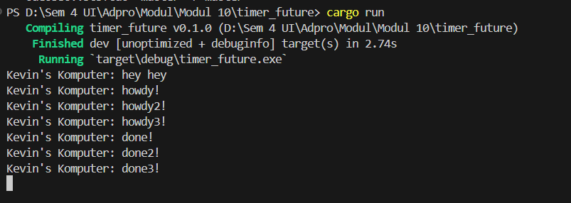
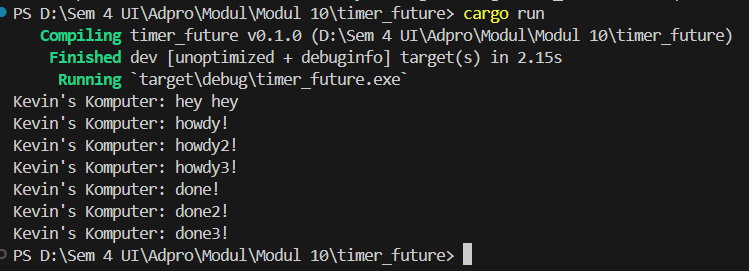

Modul 10 tutorial 1 

1.2 Understanding how it works

 It creates an executor and a spawner, where the executor is responsible for running asynchronous tasks and the spawner is used to spawn new tasks. The spawned task prints a message, waits for 2 seconds, and then prints another message. However, this task is asynchronous and doesn't block the rest of the program from continuing.

The immediate print statement "Kevin's Komputer: hey hey" is executed right away, which is why it appears first in the output. The other print statements are part of the asynchronous task and only run when the executor starts and after the TimerFuture has completed its wait. This is why "howdy" and "done" are printed after "hey hey", despite their order in the code.

1.3 Multiple Spawn and removing drop

using //drop 

not using //drop

The drop(spawner) line in this code is used to explicitly deallocate or "drop" the spawner object, freeing its memory. However, it doesn't have any effect on the running of the program or the tasks that have been spawned.

Removing the drop(spawner) line simply means that the spawner won't be deallocated at that point, but it doesn't affect the execution of the tasks that have been spawned. Those tasks will continue to run until they're complete, regardless of whether the spawner is dropped or not.

